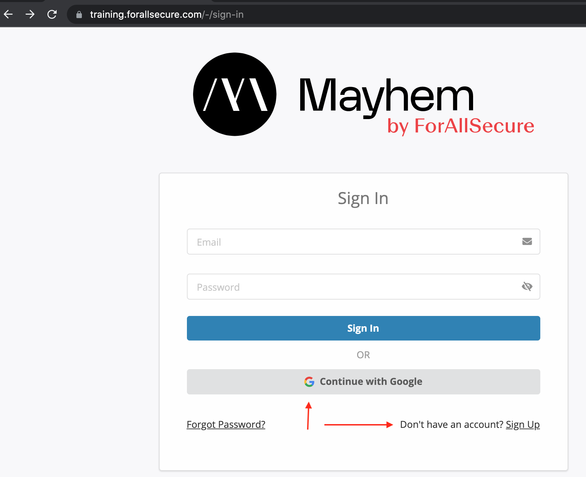
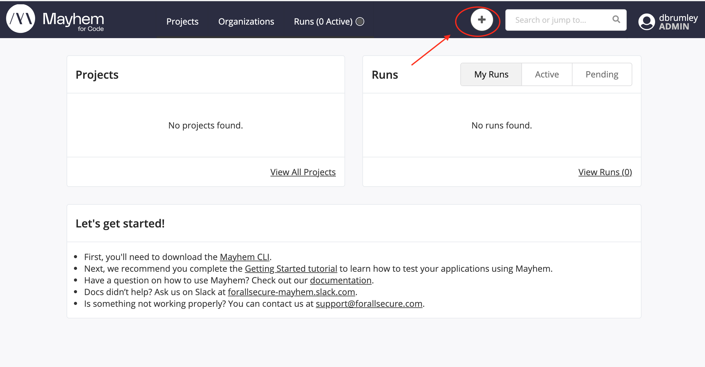
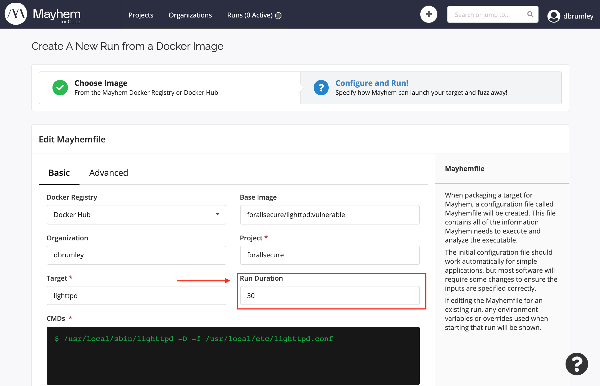
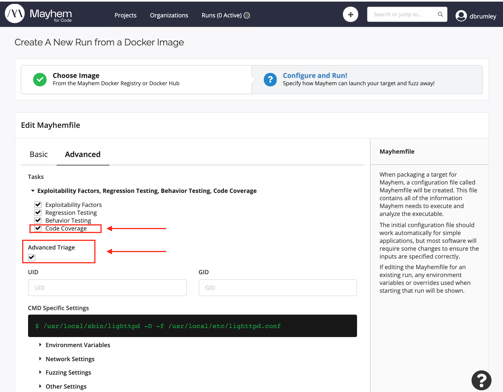
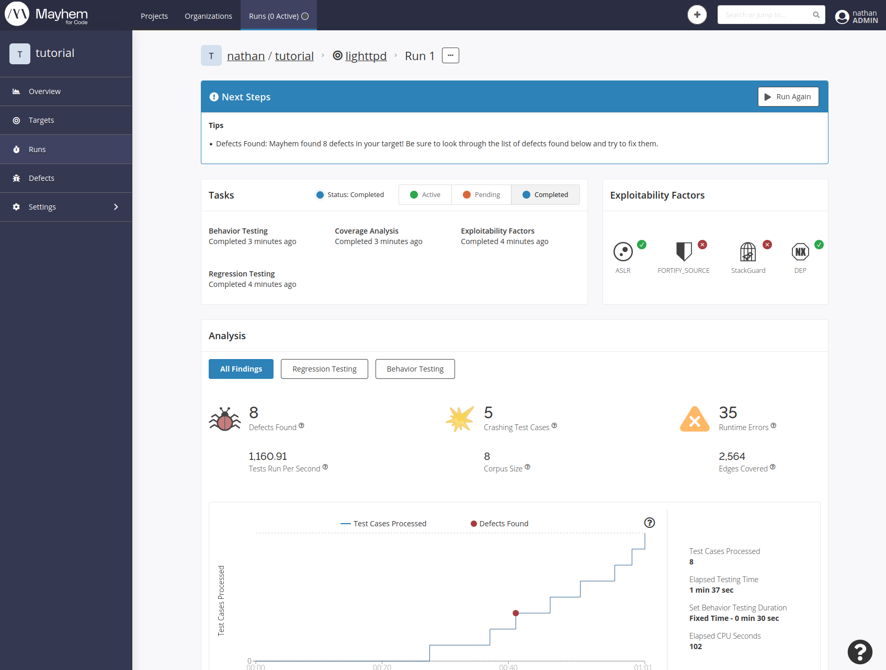
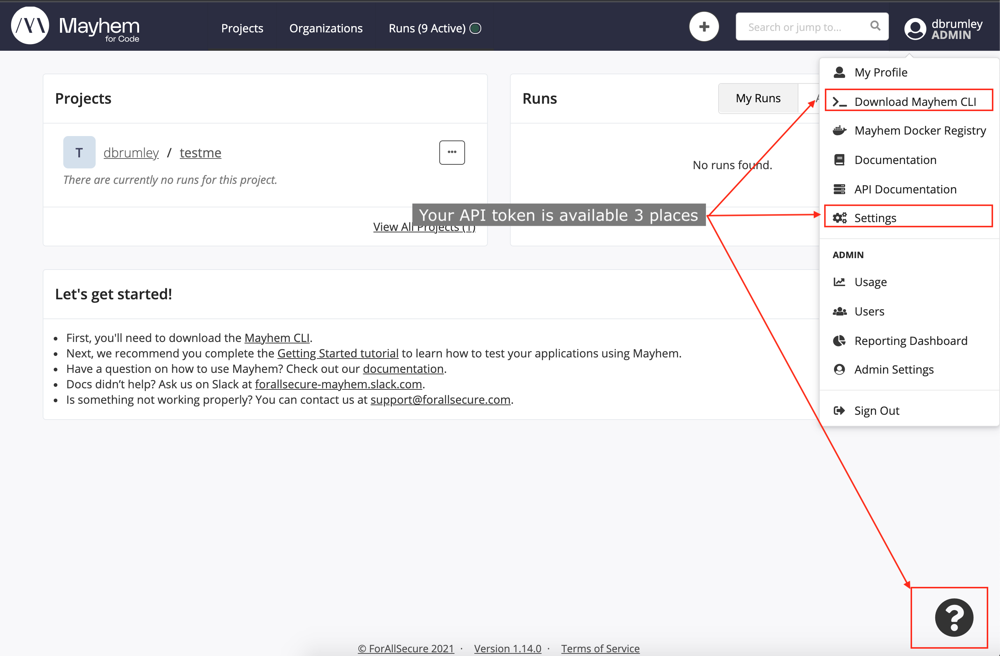

# Lab 1a: Your First Run

## Overview

This guide will show you how to get started with Mayhem using the web interface.

**Time to complete**: About 5 minutes

## Step 1. Create a Mayhem account

Create a new account by navigating to 
[training.forallsecure.com](https://training.forallsecure.com) and either choose:
   * Google account: Use your Google account on Mayhem
   * "Sign up": Create a local account on the Mayhem instance. 



## Step 2. Create a new Run

Let's reproduce an exploit for [lighttpd](https://www.lighttpd.net/)! (version
1.4.15, to be specific).

   * Create a new project by clicking the "plus" icon at the top of the screen.

   * Select the Mayhem docker registry, and the play icon next to the
   `forallsecure/tutorial/lighttpd` version 1.14.15
   image. 


## Step 3. Configure Analysis

There are two tabs of analysis options: Basic and Advanced. We will be configuring three values:
   1. Under **Basic**, set the analysis to run 30 seconds. If omitted, analysis will run
      forever in continuous fuzz mode. 

   


   2. Under **Advanced**, enable the **Advanced Triage** option and the **Code Coverage** task. 

   

   
## Step 4. Click start run!

Click the start run button at the bottom of your screen to begin analysis!


The run may take a few minutes to complete, as analysis and post-analysis
processing need to finish. Once the run completes, the web page should look
similar to this:



Congratulations!

You've just:
  * Learned how to start a new Mayhem analysis job using the web interface.
  * Found your first exploitable bug using Mayhem!
  
# Lab 1b: Run with the Mayhem CLI

## Overview

This guide will show you how to start a run using the Mayhem CLI.

**Time to complete**: About 5 minutes

## Step 1. Log in to Mayhem with the CLI

The `mayhem` CLI authenticates to the Mayhem server using an API token. The API
token  is available three places:

   * The [download screen](https://training.forallsecure.com/-/installation)
   * In your profile settings, located in the top-left under your username, then
     "Settings", then "API Tokens".
   * Under the "?" help window. 

Once you get your API token, log in the CLI:

```
mayhem login https://training.forallsecure.com/ <YOUR API KEY>
```



## Step 2. Navigate to the Tutorial Directory

The tutorial assets are already on your lab virtual machine. Change to the
directory that holds the tutorial "Mayhemfile".

```
cd fuzzing-essentials-federal/tutorial/lighttpd/
```

## Step 3. Start the run with the Mayhem CLI.

For this tutorial, no changes to the Mayhemfile are neccesary. We're starting
the same run as in lab 1a, but this time with the CLI.

```
mayhem run .
```

You should see output that looks similar to this:
```
WARNING: corpus is not a file or directory, skipping
Run started: tutorial/lighttpd/2
Run URL: https://training.forallsecure.com:443/nathan/tutorial/lighttpd/2
tutorial/lighttpd/2
```

Note the warning regarding the corpus directory is normal for this tutorial.

Navigate to the Web interface for this run by clicking on the "Run URL" from
the output in the VM's shell.

Like lab 1a, the run may take a few minutes to complete, as analysis and
post-analysis processing need to finish. Once the run completes, the web page
should look similar to this:


Congratulations!

You've just:
  * Learned how to start a new Mayhem analysis job using the CLI.
  * Learned how to find a run in the UI after starting it with the CLI.

<walkthrough-conclusion-trophy></walkthrough-conclusion-trophy>

